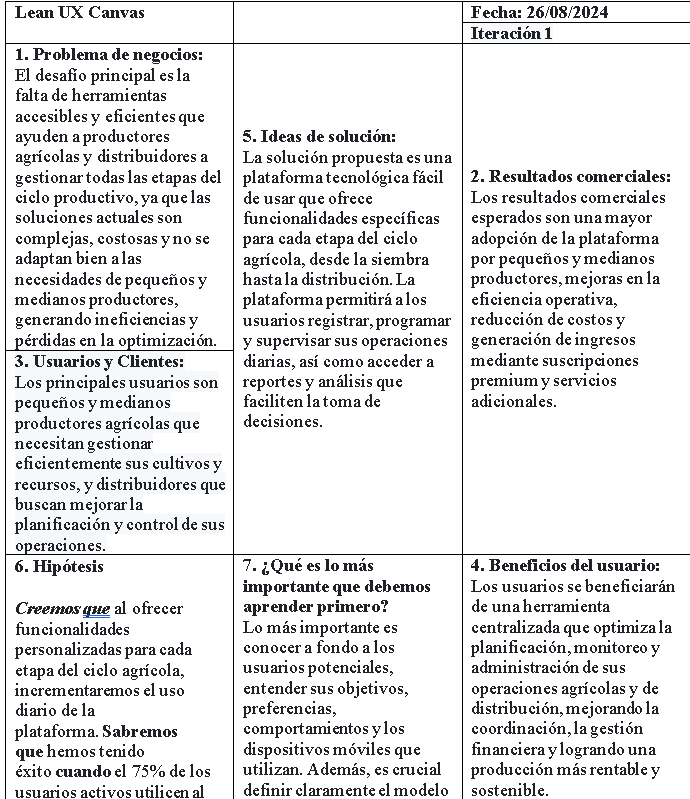

# 
COURSE PROJECT

    <strong>Universidad Peruana de Ciencias Aplicadas</strong> 
     
    <strong>Ingeniería de Software</strong> 
    <strong>Aplicaciones para Dispositivos Móviles - 366 </strong> 
    <strong>Profesor: David Gerardo Quevedo Velasco </strong> 
     INFORME TB1
      2025 - 10

# Registro de Versiones del Informe
| Version | Fecha      | Autor             | Descripcion de Modificacion                                                    |
|---------|------------|-------------------|--------------------------------------------------------------------------------|
| 0.0.1   | 09/04/2025 | Hardie Holguin   | Agregado del capítulo 1 apartado 1.1 - 1.2 - 1.3                               |
                                              
# Project Report Collaboration Insights
Link de la organizacion: https://github.com/equipo1-upc202510-366  
Link del reporte: https://github.com/equipo1-upc202510-366/DevDynasty-project-report   
URL del repositorio GitHub: https://github.com/orgs/equipo1-upc202510-366/repositories

**TB1:** Todo el equipo de trabajo colaboró en el desarrollo del sistema, dividiendo de manera equitativa las tareas entre los miembros. Además, colaboramos conjuntamente en aspectos clave, como las entrevistas con los usuarios. Este enfoque integral y cooperativo nos permitió garantizar la calidad y eficiencia en todas las etapas del proyecto.  

* Los contenidos asignados a cada miembro fueron redactados y organizados en formato Markdown, y se realizaron commits para asegurar el avance en el repositorio.
* Se generaron los artefactos necesarios utilizando las herramientas recomendadas, obteniendo enlaces de imagen desde la carpeta "assets" ubicada en la rama develop del repositorio del informe.
* Se programaron reuniones para coordinar el avance de los elementos del informe y comunicar los progresos del Sprint 1, cuyo enfoque es avanzar con la mayor parte del informe.  

  

---

# Student Outcome
<table>
  <thead>
    <tr>
      <th>Criterio Específico</th>
      <th>Acciones Realizadas</th>
      <th>Conclusiones</th>
    </tr>
  </thead>
  <tbody>
    <tr>
      <td>Actualiza conceptos y conocimientos necesarios para su desarrollo profesional y en especial para su proyecto en soluciones de ingeniería de software</td>
      <td>
        <strong>Ricardo:</strong> 
        <em>TB1:</em> El equipo de trabajo colaboró de manera conjunta en el desarrollo del sistema, distribuyendo equitativamente las tareas entre sus miembros. Además, trabajamos juntos en aspectos clave como las entrevistas con los usuarios y el desarrollo de la landing page. Este enfoque integral y colaborativo nos permitió asegurar calidad y eficiencia en todas las fases del proyecto. A través de una comunicación clara y objetiva, compartimos nuestras ideas y resultados con públicos de diversas especialidades y niveles jerárquicos durante el desarrollo del proyecto de ingeniería.  
        <strong>Fabiola:</strong> 
        <em>TB1:</em> Presenté el análisis competitivo y las estrategias de forma clara, adaptada a diferentes niveles jerárquicos. En las entrevistas, expuse los hallazgos clave de manera concisa para facilitar la comprensión de nuestros segmentos objetivos. Durante la fase de needfinding, comuniqué los resultados del User Journey Mapping y Empathy Mapping, asegurando que todos entendieran los insights esenciales para alinear el proyecto.  
        <strong>Eduardo:</strong> 
        <em>TB1:</em> Durante esta entrega, presenté el desarrollo del capítulo 3, donde expliqué de forma clara los escenarios To-Be, el mapeo de impacto y el backlog del producto. También expuse los diagramas C4 del capítulo 4, proporcionando una visión general de la arquitectura propuesta para el backend. Finalmente, detallé los apartados 5.1.1, 5.1.2 y 5.1.3 del capítulo 5, cubriendo la configuración del entorno de desarrollo, la gestión del código fuente y las convenciones de estilo.  
        <strong>Hardie</strong> 
        <em>TB1:</em> En el marco del desarrollo del proyecto, comuniqué de manera clara y objetiva los diseños de mockups y wireframes de la landing page y la aplicación web a un público diverso, incluyendo stakeholders y miembros del equipo con diferentes niveles de especialización. Mis presentaciones fueron estructuradas, destacando los principios de diseño y arquitectura de la información, lo que permitió una comprensión común de los aspectos visuales y funcionales. Esto facilitó la toma de decisiones alineadas con los objetivos del proyecto, fomentando una visión compartida.  
      </td>
      <td>
        A través de nuestra capacidad para comunicar oralmente ideas y resultados de manera clara y objetiva, facilitamos el entendimiento mutuo dentro del equipo y con otras partes interesadas. Este enfoque fue esencial para superar los desafíos durante el desarrollo del proyecto. Las sesiones de intercambio de ideas, coordinaciones de proyectos y presentaciones de avances no solo impulsaron la cohesión del equipo, sino que también permitieron integrar eficazmente los distintos componentes de la aplicación, reflejando un entendimiento exhaustivo de las necesidades del sector agrícola. Esta habilidad de comunicación fue clave para construir un entorno colaborativo que sostuvo la misión de nuestra startup de empoderar a agricultores y distribuidores, contribuyendo a un sistema que optimiza cada fase del ciclo agrícola y fomenta decisiones conjuntas informadas.
      </td>
    </tr>
    <tr>
      <td>Reconoce la necesidad del aprendizaje permanente para el desempeño profesional y el desarrollo de proyectos en soluciones de tecnologías de ingeniería de software.</td>
      <td>
        <strong>Ricardo:</strong> 
        <em>TB1:</em> Para esta entrega, se realizó un análisis detallado de las necesidades de los productores agrícolas y distribuidores a través de entrevistas. Además, se implementó un diseño UX/UI apropiado, y se llevó a cabo un análisis exhaustivo de la competencia para identificar las características diferenciadoras de nuestro sistema de gestión agrícola. Estos resultados se comunicaron de manera escrita con objetividad, permitiendo que públicos de diversas especialidades y niveles jerárquicos comprendan el avance del proyecto en ingeniería.  
        <strong>Fabiola:</strong> 
        <em>TB1:</em> Documenté el análisis competitivo y las entrevistas de forma precisa y accesible para distintos equipos. Esto permitió que los hallazgos fueran fácilmente tomados en cuenta para el desarrollo de la aplicación.  
        <strong>Eduardo:</strong> 
        <em>TB1:</em> En esta entrega, desarrollé el capítulo 3, en el cual identifiqué y documenté los segmentos objetivos y recopilé los requerimientos de software. Realicé diagramas C4 para ilustrar la arquitectura del backend, y documenté detalladamente las tecnologías seleccionadas para el proyecto. También participé en la creación de la landing page, detallando su estructura y propósito en el contexto general del proyecto.  
        <strong>Hardie:</strong> 
        <em>TB1:</em> Documenté el desarrollo del mockup y wireframe de la landing page y la aplicación web, empleando un lenguaje claro y objetivo para detallar los componentes visuales y funcionales. En los informes, expliqué las decisiones de diseño y arquitectura de la información de manera estructurada, asegurando que públicos de diferentes especialidades y niveles jerárquicos pudieran comprender las justificaciones y funcionalidades propuestas. Además, incluí guías de estilo y explicaciones de la arquitectura de la información para alinear las expectativas del equipo y otros colaboradores con los objetivos del proyecto.  
      </td>
      <td width="200px">
      La producción de documentación escrita precisa y accesible resultó vital para el éxito del proyecto. Mediante la elaboración de informes detallados y guías técnicas, el equipo logró mantener un registro claro del progreso del desarrollo del backend API, la aplicación web y la landing page de presentación. Esto no solo facilitó la transición fluida entre las distintas etapas del proceso de desarrollo, sino que también permitió a los miembros del equipo comprender el diseño y la funcionalidad de la solución tecnológica. La documentación proporcionó una base sólida indispensable para verificar y mejorar constantemente la eficacia de nuestra herramienta de gestión agrícola. Al garantizar que cada paso se documentara claramente, aseguramos que la plataforma cumpliera con nuestra visión de transformar prácticas agrícolas tradicionales en procesos más eficientes, sostenibles y rentables. 
      </td>
    </tr>
  </tbody>
</table>
# Capítulo I: Introducción
## 1.1. Startup Profile  
Sección donde presentamos al Startup y a los miembros que la conforman.  

### 1.1.1. Descripción de la Startup
Nuestra startup está enfocada en la gestión del ciclo agrícola, con el objetivo de facilitar y optimizar las actividades de productores agricolas y distribuidores. A través de un sistema integral, abarcamos todas las etapas clave del proceso agrícola, desde el sembrío hasta la distribución. Este sistema proporciona herramientas que permiten gestionar y supervisar de manera eficiente cada fase del ciclo productivo, incluyendo la siembra, riego, fumigación, recolección y distribución de productos.

El enfoque de la startup es brindar una plataforma robusta que no solo facilite el día a día de agricultores y distribuidores, sino que también impulse la eficiencia en la producción agrícola y optimice la cadena de suministro en el sector.

### Misión
Nuestra misión es transformar el sector agrícola mediante el desarrollo de soluciones tecnológicas accesibles e integradas que permitan a los productores y distribuidores optimizar sus operaciones. Buscamos empoderar a los agricultores, ayudándoles a gestionar de manera eficiente el ciclo productivo, mejorando su rentabilidad y sostenibilidad.

### Visión
Ser la plataforma líder en gestión agrícola, reconocida por nuestra capacidad de simplificar y mejorar las operaciones en el sector, fomentando una agricultura más productiva, eficiente y sostenible para agricultores y distribuidores de todas las escalas.

### 1.1.2. Perfiles de los integrantes del equipo
<table border="1" width="70%" style="text-align:center;">
    <tr align="center">
        <td rowspan="3">
            
        </td>
        <td align="left">
            <b>Nombre y Apellido:</b>
                         
            Ricardo
        </td>
    </tr>
    <tr>
        <td align="left">
        <b>Carrera:</b>
         
        Ingeniería de Software
        </td>
    </tr>
    <tr>
        <td align="left">
        <b>Acerca de:</b>
         
		   Soy un estudiante de Ingeniería de Software con conocimientos en lenguajes de programación como C#, Python, JavaScript, entre otros. Me apasiona la tecnología y el desarrollo de software, y estoy interesado en seguir aprendiendo más y desarrollar mis habilidades como programador. Además, soy responsable, proactivo y me gusta trabajar en equipo para lograr los objetivos propuestos.
        </td>
    </tr>
    <tr align="center">
        <td rowspan="3">
            
        </td>
        <td align="left">
            <b>Nombre y Apellido:</b>
                         
            Fabiola
        </td>
    </tr>
    <tr>
        <td align="left">
        <b>Carrera:</b>
         
        Ingeniería de Software
        </td>
    </tr>
    <tr>
        <td align="left">
        <b>Acerca de:</b>
         
            Soy estudiante de Ingeniería de Software en la Universidad Peruana de Ciencias Aplicadas (UPC), con una gran pasión por la tecnología y un fuerte compromiso con el aprendizaje continuo. Estoy enfocado en seguir desarrollándome profesionalmente, adquiriendo conocimientos y habilidades que me permitan enfrentar nuevos desafíos en el mundo del desarrollo de software.
            <b>Habilidades Técnicas:</b>
            <ul>
                <li><b>Lenguajes de Programación:</b> C, C++, Python, C#, JavaScript, TypeScript.</li>
                <li><b>Desarrollo Web:</b> HTML, CSS, Bootstrap, Angular.</li>
                <li><b>Base de Datos</b> MySQL.</li>
            </ul>
        </td>
    </tr>
    <tr align="center">
        <td rowspan="3">
            
        </td>
        <td align="left">
            <b>Nombre y Apellido:</b>
                         
            Eduardo
        </td>
    </tr>
    <tr>
        <td align="left">
        <b>Carrera:</b>
         
        Ingeniería de Software
        </td>
    </tr>
    <tr>
        <td align="left">
        <b>Acerca de:</b>
         
        Soy estudiante de la carrera de Ingeniería de Software en la UPC. Me considero una persona responsable, estudioso y disciplinado. Desde pequeño siempre he tenido ese interés por la tecnología y dicha curiosidad me ha llevado a elegir esta carrera. Espero en el futuro adquirir los conocimientos necesarios de esta carrera para poder vivir de lo que me gusta.
        </td>
    </tr>
    <tr align="center">
        <td rowspan="3">
            
        </td>
        <td align="left">
            <b>Nombre y Apellido:</b>
                         
            Alejandro Espino Flores
        </td>
    </tr>
    <tr>
        <td align="left">
        <b>Carrera:</b>
         
        Ingeniería de Software 
        </td>
    </tr>
    <tr>
        <td align="left">
        <b>Acerca de:</b>
         
        </td>
    </tr>
    <tr align="center">
        <td rowspan="3">
            
        </td>
        <td align="left">
            <b>Nombre y Apellido:</b>
                
            Hardie Alfonso Holguín Gamarra
        </td>
    </tr>
    <tr>
        <td align="left">
        <b>Carrera:</b>
         
        Ingeniería de Software
        </td>
    </tr>
    <tr>
        <td align="left">
        <b>Acerca de:</b>
         
      Estoy cursando la carrera de Ingeniería de Software en la UPC y tengo experiencia en lenguajes como C++, Python, JavaScript y C#. Actualmente, estoy enfocado en aprender Java. Creo que la comunicación y el trabajo en equipo con mis compañeros son fundamentales. Estoy decidido a seguir aprendiendo y a avanzar en mi desarrollo profesional.
        </td>
    </tr>
</table>

## 1.2. Solution Profile

### 1.2.1. Antecedentes y problemática
### Antecedentes:
La agricultura sigue siendo una de las principales actividades económicas a nivel global. Sin embargo, muchos productores agrícolas, especialmente los pequeños y medianos, enfrentan dificultades para gestionar eficientemente sus procesos de producción y distribución. La falta de acceso a herramientas de planificación, monitoreo y administración de recursos limita su capacidad para optimizar la producción, lo que a su vez reduce su rentabilidad y sostenibilidad. Además, los distribuidores se ven afectados por problemas de trazabilidad y coordinación en la cadena de suministro, lo que complica la entrega oportuna de productos de calidad al mercado.

### Problemática (5Ws y 2Hs)
### What/Qué
#### ¿Cuál es el problema?
Los productores agrícolas y distribuidores enfrentan desafíos en la gestión eficiente de sus operaciones. Las tareas de planificación, seguimiento de cultivos, administración de recursos y control financiero son ineficaces, lo que provoca pérdidas de tiempo y dinero.

### Where / Dónde
#### ¿Dónde surge el problema?
Este problema es global y afecta tanto a regiones con alta actividad agrícola como a zonas rurales donde el acceso a tecnologías de gestión es limitado.

### Why / Por Qué
#### ¿Cuál es la causa del problema?
La falta de herramientas tecnológicas accesibles y eficientes para monitorear y optimizar cada etapa del ciclo agrícola genera una mala gestión de recursos (semillas, agua, mano de obra) y una baja trazabilidad en la distribución de productos, afectando tanto la productividad como la sostenibilidad de los agricultores y la efectividad de los distribuidores.

### When / Cuándo
#### ¿Cuándo sucede el problema?
Los problemas surgen durante todas las etapas del ciclo agrícola, desde la planificación de la siembra hasta la distribución de productos al mercado, impactando continuamente la producción y la distribución.

### Who / Quién
#### ¿Quiénes están involucrados?
Los agricultores y distribuidores que participan en las diferentes etapas del ciclo agrícola.

### How / Cómo

#### ¿Cómo nos conocieron los usuarios?
Los usuarios nos conocieron principalmente por recomendaciones de otros productores agrícolas y distribuidores que han experimentado mejoras significativas en la gestión de sus operaciones al utilizar nuestra solución. Además, hemos realizado esfuerzos de marketing digital en redes sociales, donde promocionamos casos de éxito

#### ¿Cómo prefieren los usuarios acceder a nuestro servicio?
Los usuarios prefieren acceder a nuestro servicio a través de una aplicación web fácil de usar, que sea accesible desde cualquier dispositivo con conexión a internet, como tablets o computadoras. Este enfoque les permite gestionar y monitorear sus actividades agrícolas de forma remota y en tiempo real, asegurando que puedan adaptar sus operaciones según las necesidades específicas del ciclo productivo.

### How much / Cuánto
La falta de soluciones efectivas provoca pérdidas económicas significativas para los productores agrícolas y a su vez, los distribuidores sufren retrasos y una disminución en la calidad de los productos entregados, impactando su relación con los clientes.

### 1.2.2. Lean UX Process

#### 1.2.2.1. Lean UX Problem statements
##### Domain    
El dominio de este proyecto es la gestión del ciclo agrícola, abarcando todas las etapas desde la siembra hasta la distribución de productos agrícolas, incluyendo la coordinación de actividades, registro de operaciones, gestión de recursos e información financiera.

##### Customer Segments
###### Productores agricolas:  
  Pequeños, medianos y grandes agricultores que necesitan mejorar la planificación, gestión de recursos, y la eficiencia de sus operaciones.

###### Distribuidores:  
  Empresas que dependen de la correcta trazabilidad, calidad y entrega oportuna de productos agrícolas.

##### Pain Points
###### Registro Ineficiente:   
Problemas para registrar de manera precisa y oportuna las actividades agrícolas, lo que dificulta el seguimiento y control.

###### Falta de Coordinación:   
Dificultades en la sincronización de las distintas etapas del ciclo agrícola, resultando en ineficiencias y pérdida de tiempo.

###### Transparencia y Reportes:   
Falta de visibilidad en tiempo real sobre el estado de las operaciones y la capacidad para generar reportes detallados, dificultando la toma de decisiones informadas.

###### Optimización de Recursos:   
Dificultad para planificar y utilizar eficientemente los recursos como agua, fertilizantes y pesticidas, lo que puede llevar a desperdicios y costos innecesarios.

###### Gestión Financiera Deficiente:   
Falta de herramientas para gestionar y controlar la información financiera asociada con las operaciones agrícolas, lo que puede afectar la rentabilidad.

##### Gap
Actualmente, los agricultores y distribuidores carecen de soluciones integrales que cubran todas las etapas del ciclo agrícola desde el cultivo hasta la distribución. Los sistemas existentes suelen estar fragmentados, lo que genera ineficiencias y problemas de coordinación. Además, no había herramientas suficientes para garantizar una gestión eficaz de los recursos y una visión clara de la situación financiera.

##### Visión/Strategy
* Acceder a datos en tiempo real para una toma de decisiones más informada.
* Planificar y monitorear las etapas del proceso agrícola, desde la siembra hasta la distribución.
* Mejorar la eficiencia logística para los distribuidores, asegurando que los productos lleguen a tiempo y en condiciones óptimas.

##### Initial Segment
Compuesto por productores agrícolas pequeños y medianos, que necesitan una solución económica pero efectiva para gestionar sus operaciones diarias, así como distribuidores locales que requieren optimizar su logística y mejorar la trazabilidad de los productos que entregan.

#### 1.2.2.2. Lean UX Assumptions
#### Features
* Gestión de las etapas del ciclo agrícola (siembra, riego, fumigación, recolección, distribución).
* Programación automática de tareas clave (fechas de riego, fumigación, recolección).
* Gestión financiera y control de costos asociados a cada etapa del ciclo agrícola.

#### Business Outcomes
Tenemos como objetivo generar impactos comerciales positivos para los productores y los distribuidores, como:
* Aumento de productividad agrícola, llevando a una mayor rentabilidad para los productores.
* Reducción de costos operativos para agricultores mediante una mejor planificación.
* Mejora en la satisfacción de los usuarios al ofrecer una solución accesible y fácil de usar.

#### Business Assumptions
Suponemos que los usuarios adoptarán tecnología digital, que habrá un mercado en crecimiento y que la conectividad será accesible para todos los usuarios.
* Adaptación a la tecnología de los productores agrícolas y distribuidores para mejorar sus operaciones.
* Crecimiento de mercado con una creciente demanda de herramientas de gestión agrícola, debido a la presión por ser más eficientes y sostenibles.
* La solución será escalable para diferentes tipos de productores y distribuidores, desde pequeñas granjas hasta grandes operaciones agrícolas.

#### User Outcomes
###### Productores agrícolas: 
* Aumento en la eficiencia del uso de recursos, reducción de costos, mayor control sobre las operaciones diarias y una mejor visibilidad de las finanzas agrícolas.

###### Distribuidores: 
* Mejora en la logística de entrega y  reducción de errores en la distribución.

#### User assumptions
* Los usuarios (productores y distribuidores) estarán dispuestos a adoptar herramientas digitales, a pesar de la posible falta de familiaridad inicial.
* La mayoría de los productores y distribuidores tendrán acceso a dispositivos móviles o computadoras con conectividad a internet.
* Los usuarios estarán interesados en invertir tiempo y esfuerzo en aprender y usar la plataforma si perciben que los beneficios a largo plazo superan la inversión inicial.
* Los usuarios buscarán reducir costos y optimizar recursos, por lo que la plataforma se verá como una solución viable para mejorar sus operaciones.

#### ¿Dónde encaja nuestro producto en sus trabajos o vidas?
Se integra directamente en las operaciones diarias de los productores y distribuidores. Para los productores, facilita la planificación, monitoreo y administración de sus recursos y cultivos. Para los distribuidores, nuestro producto se convierte en una herramienta clave para mejorar la logística, asegurando una cadena de suministro más eficiente.

#### ¿Qué problema resuelve nuestro producto?
Resuelve problemas de ineficiencia en la gestión de recursos agrícolas, como la programación de riego, control de fumigación, y seguimiento de la producción. También resuelve la falta de coordinación en distribución, permitiendo que los productos lleguen a su destino de manera oportuna y con menos errores.

#### ¿Cuándo y cómo es usado nuestro producto?
Nuestro producto es utilizado durante todo el ciclo agrícola, desde la planificación de la siembra hasta la distribución de los productos. Los usuarios lo acceden desde dispositivos con conexión a internet para monitorear y gestionar sus operaciones en tiempo real. La programación de riego y fumigación, el control de costos y la gestión de la distribución son ejemplos de actividades diarias en las que el producto es indispensable.

#### ¿Qué características son importantes?
* Gestión y monitoreo en tiempo real de todas las etapas del ciclo agrícola.
* Programación automatizada de tareas clave (riego, fumigación, recolección).
* Control financiero asociado a cada etapa de la producción.

#### ¿Cómo debería verse y comportarse nuestro producto?
Nuestro producto debe tener una interfaz intuitiva y fácil de usar, permitiendo que los usuarios naveguen sin dificultad entre las distintas funcionalidades. La interfaz debe ser limpia, con accesos directos a las tareas más comunes como la programación de riego, seguimiento de recursos y control de distribución.

#### 1.2.2.4. Lean UX Hypothesis Statements
### Hipótesis 1:
***Creemos que*** los productores agrícolas adoptarán nuestra plataforma si ofrecemos una solución que les permita gestionar fácilmente las operaciones diarias del ciclo agrícola.

**Sabremos que** hemos tenido éxito **cuando** al menos el 70% de los usuarios activos registren y programen las actividades clave en nuestra plataforma.

### Hipótesis 2:
***Creemos*** los distribuidores agrícolas verán valor en nuestra plataforma si les ayuda a mejorar la planificación y el control de sus operaciones de distribución.

**Sabremos que** hemos tenido éxito **cuando** el 60% de distribuidores mejoren en coordinación y entrega de productos.

### Hipótesis 3:
***Creemos que*** una interfaz de usuario intuitiva incrementará la tasa de adopción de la plataforma entre los pequeños y medianos productores agrícolas.

**Sabremos que** hemos tenido éxito **cuando** más del 80% de los usuarios vean que la plataforma fácil de usar en las primeras dos semanas de uso.

### Hipótesis 4:
***Creemos que*** los usuarios estarán dispuestos a pagar por suscripciones premium si ofrecemos funcionalidades avanzadas como la gestión financiera detallada y reportes personalizados.

**Sabremos que** hemos tenido éxito **cuando** al menos el 30% de los usuarios pasen a una suscripción premium en los primeros seis meses.

### Hipótesis 5:
***Creemos que*** el soporte técnico y la formación a los usuarios reducirán las barreras tecnológicas y aumentarán la retención de clientes.

**Sabremos que** hemos tenido éxito **cuando** la tasa de abandono de la plataforma se reduzca a menos del 10% después del primer año.

#### 1.2.2.4. Lean UX Canvas
En Lean UX Canvas facilitamos la colaboración y el enfoque en el usuario en el diseño de productos, permitiendo a nuestro equipo definir su visión, hipótesis y métricas de éxito de manera ágil.

## 1.3. Segmentos Objetivo
| **Tipo de usuario**    | **Geográfico**                                                                                                                                                                                            | **Psicográfico**                                                                                                                                                                        | **Demográfico**                                                                                                                                                                  |
|------------------------|-----------------------------------------------------------------------------------------------------------------------------------------------------------------------------------------------------------|-----------------------------------------------------------------------------------------------------------------------------------------------------------------------------------------|----------------------------------------------------------------------------------------------------------------------------------------------------------------------------------|
| **Productor Agrícola** | Ubicado en áreas rurales o periurbanas con actividad agrícola. Pueden encontrarse en distintas regiones dependiendo del tipo de cultivo (por ejemplo, regiones de cultivo de granos, frutas, o verduras). | Motivado por la optimización de sus procesos, la mejora de la rentabilidad y la sostenibilidad. Puede valorar la tecnología como una herramienta para mejorar su trabajo.               | - **Edad:** Adultos entre 30 y 60 años.   - **Educación:** Desde formación técnica en agricultura hasta educación universitaria en áreas relacionadas con ciencias agrícolas. |
| **Distribuidor**       | Puede estar ubicado en cualquier parte del mundo, dado que la distribución puede abarcar tanto áreas locales como internacionales.                                                                        | Enfocado en la eficiencia logística, la optimización de rutas y el control de inventarios. Valora las herramientas que faciliten la planificación y gestión de la cadena de suministro. | - **Edad:** Adultos entre 25 y 55 años.   - **Educación:** Formación en logística o áreas relacionadas con la gestión de la cadena de suministro.                             |

# Capítulo II: Requirements Elicitation & Analysis
## 2.1. Competidores
Después de realizar una investigación de mercado, hemos identificado tres plataformas que ofrecen características similares a las de nuestra aplicación AgroControl para la gestión del ciclo agrícola. Estas plataformas son:
1. **Bushel Farm:**
   Bushel Farm es una plataforma que permite a los productores agricolas gestionar y optimizar sus operaciones agrícolas mediante el seguimiento del clima, monitoreo de rendimiento de cultivos y análisis de datos históricos. Es utilizada principalmente por productores agricolas que buscan mejorar la eficiencia en sus campos a través de herramientas digitales que les ayuden en la toma de decisiones informadas.

    

2. **Trimble Ag Software:**
Trimble Ag Software ofrece una solución integral para la gestión agrícola, que incluye la planificación de cultivos, seguimiento de insumos, gestión de inventarios y análisis de datos. La plataforma es conocida por su integración con maquinaria agrícola, lo que permite una precisión y optimización superior en las operaciones diarias.

                

3. **Agroptima:**
Agroptima es una aplicación diseñada para facilitar la gestión de las actividades agrícolas, permitiendo a los productores agricolas registrar todas las operaciones de sus campos, generar informes detallados y gestionar sus finanzas de manera eficiente. Es reconocida por su accesibilidad y facilidad de uso, siendo ideal para pequeños y medianos productores agricolas.

                

### 2.1.1. Análisis competitivo
<table>
  <tr>
    <th colspan="7" valign="top"><b>Competitive Analysis Landscape</b></th>
  </tr>
  <tr>
    <td colspan="2" rowspan="2">¿Por qué llevar a cabo este análisis?</td>
    <td colspan="5">Escriba en el recuadro la pregunta que busca responder o el objetivo de este análisis.</td>
  </tr>
  <tr>
    <td colspan="5">Este análisis se realizó con la finalidad de poder identificar a nuestros potenciales competidores e idear estrategias y tácticas para diferenciarnos de estos.</td>
  </tr>
  <tr>
    <td colspan="3">(En la cabecera colocar por cada competidor nombre y logo)</td>
    <td colspan="1" valign="top" style="font-weight: bold;">
        AgroControl
         
        

                
        

    <td colspan="1" valign="top" style="font-weight: bold;">
    Bushel Farm
    

                
        

    </td>
    <td colspan="1" valign="top" style="font-weight: bold;">
      Trimble Ag Software
      

                
            

      </td>
    <td colspan="1" valign="top" style="font-weight: bold;" >
      Agroptima
      

                
            

    </td>
  </tr>
  <tr>
    <td colspan="1" rowspan="2">
Perfil
</td>
    <td colspan="2">Overview</td>
    <td colspan="1" valign="top">Aplicación integral para la gestión del ciclo agrícola, que optimiza procesos clave como el sembrío, riego y cosecha, adaptándose a las necesidades de productores agricolas y distribuidores.</td>
    <td colspan="1" valign="top">Plataforma que permite a los productores agricolas gestionar sus operaciones agrícolas mediante el seguimiento del clima, rendimiento de cultivos y análisis de datos históricos.</td>
    <td colspan="1" valign="top">Solución integral que combina la planificación agrícola y la gestión de inventarios con la integración de maquinaria, optimizando las operaciones diarias.</td>
    <td colspan="1" valign="top">Aplicación que facilita la gestión de actividades agrícolas, permitiendo registrar operaciones, generar informes y manejar finanzas, especialmente diseñada para pequeños y medianos productores agricolas.</td>
  </tr>
  <tr>
    <td colspan="2">Ventaja competitiva</td>
    <td colspan="1" valign="top">AgroControl proporciona una solución completa para la gestión agrícola, abarcando desde el sembrío hasta el reparto. Su ventaja competitiva radica en ofrecer una plataforma unificada que optimiza todos los procesos agrícolas. Se adapta a las necesidades de productores agricolas y distribuidores con una interfaz intuitiva y funcionalidades específicas para el control de inventario, añadiendo un valor significativo en comparación con otras soluciones disponibles.</td>
    <td colspan="1" valign="top">Bushel Farm destaca por su capacidad para integrar datos climáticos, rendimiento de cultivos y análisis históricos en una sola plataforma. Su ventaja radica en la mejora de la eficiencia mediante el análisis de datos detallados y la toma de decisiones informadas basadas en información en tiempo real.</td>
    <td colspan="1" valign="top">Trimble Ag Software proporciona una solución completa que abarca desde la planificación de cultivos hasta la gestión de inventarios, con una integración destacada con maquinaria agrícola. Esto permite una optimización superior en las operaciones diarias y una precisión que mejora la eficacia de las tareas agrícolas.</td>
    <td colspan="1" valign="top">Agroptima se enfoca en la simplicidad y accesibilidad para pequeños y medianos productores agricolas. Su ventaja es la facilidad de uso para registrar operaciones, generar informes y gestionar finanzas, lo que permite a los usuarios manejar sus actividades agrícolas de manera más eficiente y con menor complejidad.</td>
  </tr>
  <tr>
    <td colspan="1" rowspan="2">
Perfil de Marketing
</td>
    <td colspan="2">Mercado objetivo</td>
    <td colspan="1" valign="top">Productores Agricolas y distribuidores que buscan una solución completa para la gestión del ciclo agrícola, incluyendo sembrío, riego, fumigación, cosecha y reparto.</td>
    <td colspan="1" valign="top">Productores Agricolas que buscan optimizar sus operaciones mediante el seguimiento del clima, rendimiento de cultivos y análisis de datos históricos.</td>
    <td colspan="1" valign="top">Productores Agricolas que necesitan una solución integral para la planificación de cultivos, gestión de insumos e integración con maquinaria agrícola</td>
    <td colspan="1" valign="top">Productores Agricolas pequeños y medianos que desean gestionar sus operaciones, generar informes y manejar finanzas de manera accesible</td>
  </tr>
  <tr>
    <td colspan="2">Estrategias de marketing</td>
    <td colspan="1" valign="top">Campañas de marketing digital dirigidas a productores agricolas y distribuidores, participación en ferias agrícolas y eventos del sector, y presencia en redes sociales.</td>
    <td colspan="1" valign="top">Participación en eventos agrícolas y presencia en redes sociales.</td>
    <td colspan="1" valign="top">Participación en eventos del sector, publicidad en revistas especializadas y presencia en redes sociales</td>
    <td colspan="1" valign="top">Publicidad en redes sociales, colaboraciones con influencers del sector agrícola, y eventos locales.</td>
  </tr>
  <tr>
    <td colspan="1" rowspan="3">
Perfil de Producto
</td>
    <td colspan="2">Productos & Servicios</td>
    <td colspan="1" valign="top">Plataforma integral para la gestión del ciclo agrícola que incluye funcionalidades para sembrío, riego, fumigación, cosecha y reparto. Ofrece herramientas específicas para productores agricolas y distribuidores, incluyendo la gestión de inventarios y la optimización de procesos agrícolas en una sola plataforma.</td>
    <td colspan="1" valign="top">Plataforma digital para la gestión agrícola que permite a los productores agricolas optimizar sus operaciones mediante el seguimiento del clima, monitoreo del rendimiento de cultivos y análisis de datos históricos.</td>
    <td colspan="1" valign="top">Solución integral que combina planificación agrícola, gestión de inventarios, seguimiento de insumos y análisis de datos. Destaca por su integración con maquinaria agrícola para una optimización precisa de las operaciones diarias.</td>
    <td colspan="1" valign="top">Aplicación para la gestión de actividades agrícolas, que facilita el registro de operaciones, la generación de informes y la gestión de finanzas. Diseñada para pequeños y medianos productores agricolas, ofrece una interfaz accesible y herramientas específicas para la administración de campos.</td>
  </tr>
 <tr>
    <td colspan="2">Precios & Costos</td>
    <td colspan="1" valign="top">
        <strong>Productores Agricolas:</strong> 
        <strong>Plan Básico:</strong> $20 al mes. Permite la gestión de un solo campo de cultivo. Incluye funcionalidades esenciales para sembrío, riego y cosecha. 
        <strong>Plan Premium:</strong> $90 al mes. Permite la gestión de dos o más campos de cultivo. Incluye todas las funcionalidades del Plan Básico más herramientas avanzadas para fumigación, cosecha y reparto, análisis de datos avanzados y soporte prioritario.  
        <strong>Distribuidores:</strong> 
        <strong>Plan de Gestión Avanzada:</strong> $100 al mes. Incluye funcionalidades completas para el control del inventario, análisis de ventas, y herramientas específicas para la gestión y optimización de la cadena de suministro.
    </td>
    <td colspan="1" valign="top">
	<strong>Plan Gratuito:</strong>Funcionalidades básicas limitadas 
        <strong>Planes de Suscripción:</strong>Rango de $25 a $100 al mes, dependiendo de las funcionalidades adicionales y el tamaño de la operación.  
       </td>
    <td colspan="1" valign="top">Planes Personalizados: Los precios varían según el tamaño de la operación y las funcionalidades requeridas. Generalmente oscilan entre $200 y $500 al mes.</td>
    <td colspan="1" valign="top">
	<strong>Plan Básico:</strong>$30 al mes. Incluye funcionalidades básicas para la gestión de un solo campo. 
        <strong>Plan Avanzado:</strong>$80 al mes. Incluye funcionalidades adicionales para la gestión de múltiples campos, finanzas y generación de informes detallados.  
    </td>
</tr>

  <tr>
    <td colspan="2">Canales de distribución (Web y/o Móvil)</td>
    <td colspan="1" valign="top">Canal de distribución digital web.</td>
    <td colspan="1" valign="top">Accesible vía Web y a través de aplicaciones móviles</td>
    <td colspan="1" valign="top">Ofrece acceso tanto a través de la Web como en dispositivos móviles</td>
    <td colspan="1" valign="top">Disponible en plataformas Web y móvil</td>
  </tr>
</table>

### 2.1.2. Estrategias y tácticas frente a competidores
<table>
<tr>
    <td colspan="1" rowspan="5">
Análisis SWOT
</td>
    <td colspan="6">Realice esto para su startup y sus competidores. Sus fortalezas deberían apoyar sus oportunidades y contribuir a lo que ustedes definen como su posible ventaja competitiva.</td>
  </tr>
  <tr>
    <td colspan="2">Fortalezas</td>
    <td colspan="1" valign="top">Ofrece una solución integral para todo el ciclo agrícola en una sola plataforma, destacando en la optimización de procesos y en funcionalidades específicas para distribuidores, con una interfaz intuitiva.</td>
    <td colspan="1" valign="top">Sobresale por su sistema avanzado de seguimiento climático y de cultivos, facilitando la toma de decisiones con su análisis de datos históricos, lo que mejora la eficiencia en la gestión agrícola.</td>
    <td colspan="1" valign="top">Destaca por su integración completa de planificación y gestión agrícola con maquinaria avanzada, optimizando la precisión y eficiencia operativa.</td>
    <td colspan="1" valign="top">Se distingue por su facilidad de uso y enfoque en pequeños y medianos productores agricolas, ofreciendo una gestión simple de operaciones y finanzas.</td>
  </tr>
  <tr>
    <td colspan="2">Debilidades</td>
    <td colspan="1" valign="top">Carece de integración con maquinaria agrícola y podría enfrentar dificultades para escalar sus servicios a grandes distribuidores.</td>
    <td colspan="1" valign="top">Puede tener limitaciones en la integración con maquinaria agrícola y carece de funcionalidades avanzadas para la gestión de inventarios y distribución.</td>
    <td colspan="1" valign="top">Puede ser costoso y complejo para pequeños productores agricolas debido a su enfoque en soluciones integrales y la integración de maquinaria avanzada.</td>
    <td colspan="1" valign="top">Podría ser menos adecuada para grandes operaciones agrícolas y carece de herramientas avanzadas para el análisis de datos y la optimización de la cadena de suministro.</td>
  </tr>
  <tr>
    <td colspan="2">Oportunidades</td>
    <td colspan="1" valign="top">Tiene la oportunidad de expandirse al integrar tecnologías avanzadas como IoT y Big Data, así como de atraer a grandes distribuidores mediante la escalabilidad de sus servicios y funcionalidades personalizadas.</td>
    <td colspan="1" valign="top">Puede aprovechar el crecimiento de la digitalización en la agricultura y expandir su presencia en mercados internacionales mediante la mejora de sus herramientas de análisis de datos y su integración con otras tecnologías agrícolas.</td>
    <td colspan="1" valign="top">Tiene la oportunidad de consolidar su liderazgo mediante la expansión de sus funcionalidades y la integración con nuevas tecnologías emergentes, así como fortalecer su presencia en mercados en desarrollo.</td>
    <td colspan="1" valign="top">Puede crecer al expandir su oferta de funcionalidades y mejorar su accesibilidad para más tipos de usuarios, así como aprovechar la creciente demanda de soluciones accesibles y fáciles de usar en el mercado agrícola.</td>
  </tr>
  <tr>
    <td colspan="2">Amenazas</td>
    <td colspan="1" valign="top">La integración incompleta con maquinaria agrícola y los desafíos de escalabilidad para grandes distribuidores representan amenazas significativas. La plataforma también debe enfrentar la competencia de soluciones más establecidas que ofrecen características más avanzadas.</td>
    <td colspan="1" valign="top">Puede enfrentar amenazas relacionadas con la rápida evolución tecnológica y la necesidad de mantenerse al día con nuevas herramientas y funcionalidades. Además, la creciente competencia en el mercado de gestión agrícola podría limitar su capacidad para captar nuevos usuarios.</td>
    <td colspan="1" valign="top">La complejidad y el costo de sus soluciones pueden ser una barrera para pequeños productores agricolas y nuevos entrantes en el mercado. También enfrenta riesgos asociados con la integración de múltiples tecnologías y la necesidad de continuar innovando para mantener su liderazgo.</td>
    <td colspan="1" valign="top">La falta de personalización avanzada y la posible saturación del mercado con aplicaciones similares pueden limitar su capacidad para diferenciarse. Además, la dependencia de características básicas puede hacer que la plataforma sea menos atractiva para usuarios con necesidades más complejas.</td>
  </tr>
</table>

## 2.2. Entrevistas
### 2.2.1. Diseño de entrevistas
En esta sección se han definido una serie de preguntas para nuestros segmentos objetivos, con la finalidad de obtener información cualitativa como opiniones y descripciones. Esta información será de gran ayuda en el desarrollo de nuestra solución.

**Preguntas generales:**

1. ¿Cuál es tu nombre?
2. ¿Qué edad tienes?
3. ¿Dónde vives actualmente?
4. ¿A qué te dedicas?
5. ¿Cual es el navegador (browser) que más usas?
6. ¿Cual es el dispositivo que más usas?

**Preguntas Segmento 1: Productores Agricolas**

1. ¿Cuáles son los principales desafíos que enfrentas en la gestión de tus campos de cultivo?
2. ¿Qué herramientas utilizas actualmente para la gestión de tus operaciones agrícolas?
3. ¿Qué funcionalidades consideras más importantes en una aplicación de gestión agrícola?
4. ¿Qué aspectos te gustaría mejorar en las herramientas actuales que usas?
5. ¿Con qué frecuencia utilizas tecnología para la gestión de tus cultivos?
6. ¿Qué tipo de datos o información te gustaría que te proporcionara una aplicación de gestión agrícola?
7. ¿Cómo manejas actualmente el seguimiento de tus gastos e ingresos relacionados con la agricultura?
8. ¿Qué tipo de análisis o reportes serían útiles para ti en una plataforma de gestión agrícola?
9. ¿Cómo te gustaría que una aplicación te ayude en la toma de decisiones para la gestión de tus campos?

**Preguntas Segmento 2: Distribuidores**

1. ¿Cuáles son los mayores retos en la gestión del inventario y las ventas en tu negocio?
2. ¿Qué sistemas usas actualmente para el control del inventario y las ventas?
3. ¿Qué características consideras imprescindibles en una herramienta de gestión para distribuidores?
4. ¿Cómo te gustaría que se integren las funcionalidades de la aplicación con tus procesos actuales?
5. ¿Qué mejorarías en los sistemas actuales que utilizas para la gestión de inventarios?
6. ¿Con qué frecuencia revisas o actualizas el inventario en tu sistema actual?
7. ¿Qué tipo de reportes o análisis de ventas encuentras más útiles para tu negocio?
8. ¿Cómo manejas actualmente la comunicación y coordinación con los productores agricolas?
9. ¿Qué tipo de soporte adicional o capacitación consideras necesaria para una nueva herramienta de gestión?
10. ¿Cómo prefieres que una aplicación te ayude a optimizar la cadena de suministro y la gestión de ventas?

### 2.2.2 Registro de entrevistas.

Link Entrevistas: https://shorturl.at/Nxe2d

**Segmento Productor Agricola:**

**Entrevista 1:**

Nombres: Isidro 

Apellidos: Principe Ramirez

Edad: 65 años

Lugar de residencia: Lima, Peru

Evidencia de la entrevista:

Timing Entrevista: 00:05 - 06:30

Resumen de la entrevista:
El señor Isidro Principe Ramirez, un productor agrícola de 65 años de Lima, Perú, nos compartió algunos de los desafíos que enfrenta en la gestión de sus cultivos. Señaló que uno de los mayores retos es mantener un control preciso de las distintas etapas del proceso agrícola, como las fechas de fumigación y el manejo de los insumos. Actualmente, utiliza un cuaderno para registrar esta información, pero expresó interés en adoptar soluciones tecnológicas que le ayuden a optimizar esta tarea.

Además, comentó que utiliza diversas herramientas agrícolas, como mochilas a motor y otras maquinarias, para el manejo de sus campos. En cuanto a la toma de decisiones, manifestó que le gustaría recibir informes detallados sobre el estado de sus cultivos para poder hacer un mejor seguimiento y planificar de manera más eficiente.

Características observadas:

Personalidad: Proactivo, con disposición hacia el uso de tecnología para mejorar sus procesos.
Influencias: Limitado uso de herramientas tecnológicas, pero abierto al cambio.
Canales de interacción: Actualmente utiliza herramientas manuales, pero con interés en digitalización.
Dispositivos: Sin mención específica de dispositivos, pero se podría inferir que es usuario potencial de software en dispositivos móviles.

**Entrevista 2:**

Nombres: Fidel 

Apellidos: Godoy Zevallos

Edad: 60 años

Lugar de residencia: Lima, Peru

Evidencia de la entrevista:

Timing Entrevista: 06:31 - 13:51

Resumen de la entrevista:
El señor Fidel Godoy Zevallos, un productor agrícola de 60 años de Lima, Perú, compartió que su desafío más significativo en la gestión agrícola es el registro de operaciones y gastos. Aunque utiliza Excel para este propósito, considera que esta herramienta no es muy efectiva.

Se mostró interesado en mejorar el sistema de riego para sus cultivos y en utilizar herramientas tecnológicas que faciliten una mejor cosecha. Además, enfatizó la importancia de recibir información sobre el clima, la calidad del suelo y otros factores relevantes para tomar decisiones informadas en la gestión de sus cultivos.

Características observadas:

Personalidad: Reflexivo, con interés en la mejora continua de su gestión agrícola.
Influencias: Uso limitado de herramientas tecnológicas, busca alternativas más eficientes.
Canales de interacción: Principalmente herramientas manuales, con apertura hacia la digitalización.
Dispositivos: Sin mención específica de dispositivos, pero potencialmente un usuario de software agrícola en dispositivos móviles.

Resumen de la entrevista:
La señora Elizabeth Caro, productora agrícola de 59 años, nos compartió los desafíos que enfrenta en la gestión de sus cultivos, siendo el más destacado la irregularidad en la entrega de agua para riego, tanto por parte de las autoridades como en años de sequía. Utiliza principalmente mano de obra para tareas como el sembrado, limpieza, arado, mantenimiento y cosecha, empleando herramientas manuales como lampas, picos, machetes y javas para almacenar sus productos.

Elizabeth considera esencial contar con una aplicación de gestión agrícola que le brinde información sobre la producción nacional de frutas y semillas, como mangos, uvas, paltas y naranjas, para facilitar la comercialización de sus cultivos. Aunque está satisfecha con las herramientas manuales que utiliza, siente que necesita mayor acceso a información para mejorar la venta de sus productos.

Su uso de tecnología se limita a buscar en Internet sobre plagas que pueden afectar sus cultivos. En términos de necesidades tecnológicas, le gustaría tener una aplicación que le permita llevar un control preciso del inventario de cosechas y ventas, así como calcular las utilidades netas después de deducir los gastos operativos, como el pago a trabajadores.

Actualmente, gestiona manualmente el seguimiento de ingresos y gastos relacionados con la agricultura, contabilizando la cantidad de jabas producidas y vendidas, así como los gastos en personal. Sería útil para ella contar con una plataforma que ofrezca reportes detallados sobre ventas en términos de unidades y valores, así como sobre gastos en insumos y mantenimiento del cultivo. Además, desearía que la aplicación la apoye en la toma de decisiones estratégicas, facilitando la exhibición de sus productos y permitiendo que sus socios tengan acceso en tiempo real a la información de ventas, tanto en unidades como en valores, optimizando así el control y la gestión financiera de su producción agrícola.

Características observadas:

Personalidad: Proactiva y con interés en optimizar su gestión agrícola.
Influencias: Uso limitado de tecnología, busca herramientas que faciliten la toma de decisiones.
Canales de interacción: Predominantemente manuales, con un interés en digitalización.
Dispositivos: Sin mención específica de dispositivos, pero potencialmente abierta al uso de software en dispositivos móviles para la gestión agrícola.

**Segmento Distribuidor:**

**Entrevista 1:**

Entrevistas #01: **William Ramos** (**28 años - Surco**) - **29 de agosto del 2024** 

Timing Entrevista: 22:40 - 32:51

Resumen de la entrevista: La entrevista se ha realizado al distribuidor William Ramos de 28 años, quien cuenta con experiencia en la distribución de semillas, fumigantes y fertilizantes para el sector agrícola. William nos comenta que enfrenta muchos problemas al momento de inventariar una gran cantidad de pedidos, teniendo que realizar inventarios por región, departamentos y meses. Anteriormente, utilizaba hojas de Excel, pero debido a la gran cantidad de datos, optó por usar varias hojas en Google Drive, aprovechando su capacidad de almacenamiento.

Respecto a las funcionalidades que le gustaría tener, menciona que desea poder registrar los gastos e ingresos para poder evaluar la utilidad obtenida. También le gustaría clasificar los productos, incluyendo diferentes tipos de semillas, fumigantes y fertilizantes. Además, comenta que sería útil realizar el inventario directamente en la plataforma, evitando la búsqueda en múltiples carpetas y problemas de almacenamiento. William también desea tener la capacidad de observar en qué lugares realiza más ventas y registrar incidentes en la entrega del producto, como rupturas o robos.

En cuanto a la comunicación con sus clientes, William utiliza redes sociales como Instagram y TikTok, pero para compras en grandes cantidades, prefiere comunicarse por correo electrónico o WhatsApp. Su navegador preferido es Google Chrome, y aunque dispone de celular y computadora, utiliza principalmente la computadora.

Finalmente, expresa que estaría dispuesto a utilizar un software que le ayude a optimizar las ventas y el inventario, siempre que cumpla con las funcionalidades que mencionó anteriormente.

Características observadas:

Personalidad: Proactivo, busca optimizar procesos y abierto a nuevas tecnologías. 
Influencias: Limitado por herramientas actuales, pero con disposición al cambio. 
Canales de interacción: Utiliza redes sociales y aplicaciones de mensajería, además de correo electrónico. 
Dispositivos: Principalmente utiliza computadora, pero también tiene acceso a un celular.

**Entrevista 2:**

Nombre: **Jorge** 

Apellido: **Gonzales**

Edad: **52 años**

Lugar de residencia: **Lima, Perú**

Timing Entrevista: 32:52 - 38:52

Resumen de la entrevista: La entrevista se ha realizado al distribuidor Jorge Gonzales de 52 años, quien se encuentra en el sector de productos alimenticios. Jorge enfrenta retos en la gestión de inventario, principalmente en mantener el equilibrio entre oferta y demanda, así como la precisión en los registros y evitar el exceso y escasez de inventario. Actualmente, utiliza sistemas de gestión combinados con hojas de cálculo, aunque estos no siempre son ágiles ni ofrecen las capacidades necesarias para optimizar sus procesos.

Además, el mayorista busca una solución que se integre fácilmente con sus procesos actuales, permitiendo la sincronización automática de datos entre ventas e inventario, y que ofrezca una interfaz más intuitiva y personalizable. Los reportes detallados de ventas, análisis de márgenes de beneficio y las tendencias de ventas a lo largo del tiempo son funcionalidades clave que deben incorporarse, ya que son esenciales para la toma de decisiones estratégicas.

En cuanto a la comunicación, actualmente es manual y se realiza a través de la aplicación WhatsApp. Jorge considera que necesita plataformas que mejoren la coordinación, como un sistema de mensajería directa o alertas automatizadas para sincronizar órdenes y entregas.

Características observadas:

Personalidad: Organizado, busca soluciones que optimicen la gestión y la toma de decisiones. 
Influencias: Limitado por la combinación de herramientas actuales, pero abierto a nuevas integraciones. 
Canales de interacción: Utiliza WhatsApp para la comunicación, pero busca mejorar la coordinación.
Dispositivos: Usa principalmente un celular pero tambien se apoya con una tablet.

